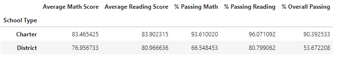

# School_District_Analysis

## Overview of the school district analysis

A school disctrict asked for a snapshot of several important metrics by each school and also at the disctrict level. The analysis focused on math and reading scores in preparation for an upcoming board meeting. After reviewing the data it was determined that Thomas High School's 9th grade class was thought to be cheating. The school board asked for the data to be analyzed again to be sure of their results. Below are a few of the items we will be reviewing for anomalies.

* The affect on the district summary.
* The affect on the school summary.
* The affect of replacing the ninth graders’ math and reading scores in relation to Thomas High School’s performance.

## Resources

* Data sources: student_complete.csv and schools_complete.csv

## Summary

The image above shows all relevant statistics in relation to how the students performed.

The image above shows schools based on spending.

The image above shows schools based on type.

The image above shows schools based on size.

The image above shows the top five lowest performing schools.

The image above shos the top five highest performing schools.

